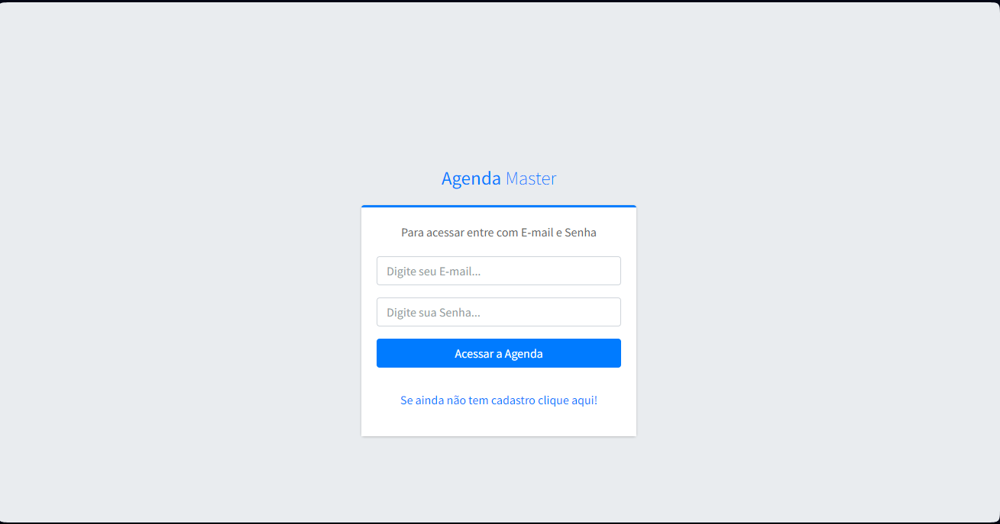
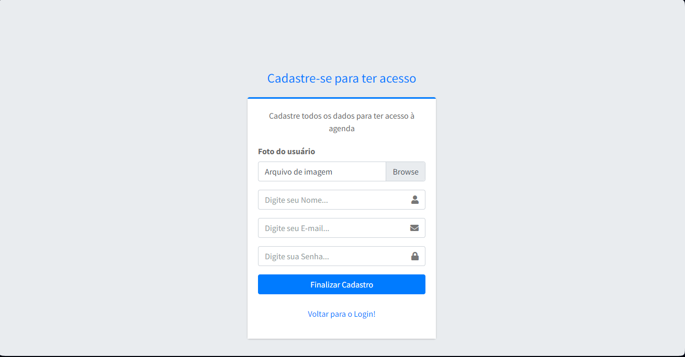

# Sistema de Agenda Eletrônica 




## Descrição

O **Sistema de Agenda Eletrônica** é uma plataforma desenvolvida para gerenciar de uma forma eficiente sua lista de contatos que você tem em seu celular, para uma melhor organização e esquematização de seus contatinhos.

## Funcionalidades

- Registro de Contatos 
- Edição e Remoção de Contatos
- Interface amigável e fácil de usar
- Funcionalidade de pesquisa
- Filtro Para Busca Contatos

## Pré-requisitos

> [!IMPORTANT]  
Antes de começar, você precisará ter as seguintes ferramentas instaladas em sua máquina:

- [Git](https://git-scm.com)
- [PHP](https://www.php.net/)
- [MySQL](https://www.mysql.com/)
- Um servidor web como [XAMPP](https://www.apachefriends.org/index.html) ou [WAMP](http://www.wampserver.com/en/)

## Instalação

1. Clone o repositório para sua máquina local:

```bash
git clone https://github.com/dvizioon/AGENDA-MASTER.git
```

2. Navegue até o diretório do projeto:

```bash
cd AGENDA-MASTER
```

> [!CAUTION]
> se você estiver usando um servidor embutido lembre-se de configurar o caminho das ext no php.ini/ para reconhecer as DLLS.

3. Configure seu servidor web para apontar para o diretório do projeto.

4. Importe o banco de dados MySQL:

    - Abra o phpMyAdmin / ou outro SGBD.
    - Importe o arquivo `script.sql` localizado no diretório `packages`.


# Configuração do script.sql 📤
> [!WARNING]  
> Entre no pasta `packages` e mude as configurações do banco hein `script.sql` depois importe ao SGBD.
```sql

-- Opcional você pode Personalizar a Criação com
-- outro nome de banco,mais lembre-se de trocar
-- no arquivo de conexão do php_mysqli e pdo_driver

create database `agenda`;
use `agenda`;

-- Restos das Configuraçãoes do Banco
...

```

# Configuração Manual Connector para o Sistema de Agenda📦⚠️

> [!WARNING]  
> Entre no Arquivo `config/conexao.php` e mude o host o banco o usuario é senha para que o Sistema em Geral Funcione.
```php


try{

    @DEFINE('HOST','seu_host');
    @DEFINE('BD','seu_banco');
    @DEFINE('USER','seu_usuario');
    @DEFINE('PASS','sua_senha');

    $conect = new PDO('mysql:host='.HOST.';dbname='.BD,USER,PASS);
    $conect -> setAttribute(PDO::ATTR_ERRMODE, PDO::ERRMODE_EXCEPTION);

}catch(PDOException $e){
    echo "<strong>ERRO DE PDO = </strong>".$e->getMessage();
}
    

```


## Uso

Abra seu navegador e vá para `http://localhost/AGENDA-MASTER` para ver o sistema em ação.

### Páginas dos Login


> [!IMPORTANT]  
Antes de você realizar o login, primeiro certifique-se de ter realizado ao cadastro
pois o cadastro funciona com cookies.

### Páginas dos Cadastro




### Painel


### Relatorio


## Licença

Distribuído sob a licença MIT. Veja `LICENSE` para mais informações.
